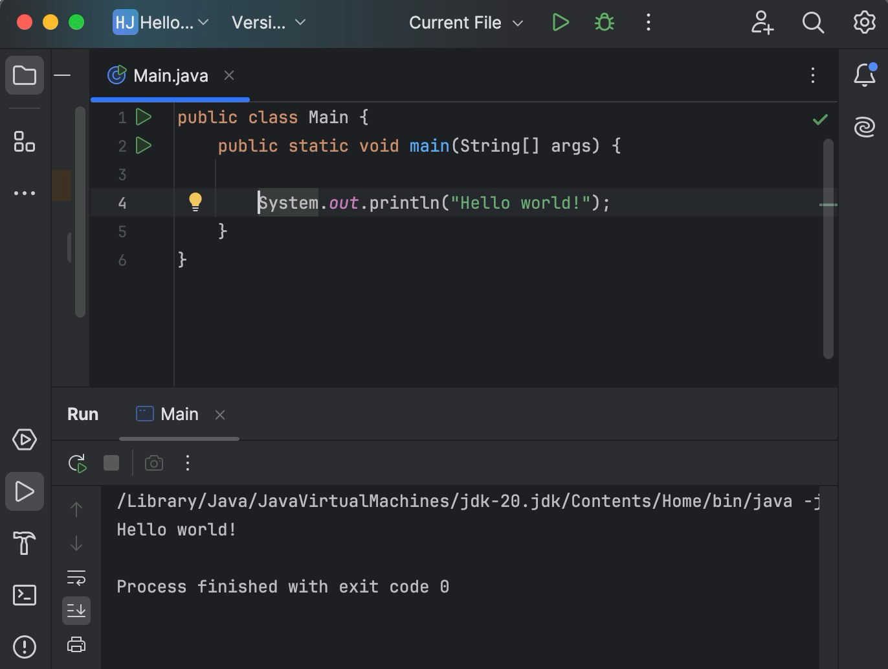

1.What is the use of the git add command?
Ans:The git add command us used to stage changes in your files, preparing them to be included in the next commit. It tells the Git which changes you want to track and save when you run git commit.

2.Write the command to create a branch “feature-group”.
Ans:The command to create a branch named feature-group is:
                 git branch feature-group
      This creates a new branch but doesn’t switch to it unless you use git checkout or git                          
switch.

3.What is a pull request? Write the steps involved in creating a pull request.
Ans:A pull request is a way to propose changes you've made in a branch to be merged into another branch, usually the main branch in a shared repository.
It allows team members to review, discuss, and approve the changes before merging them.
Steps to create a Pull Request:

1.Push your changes to a branch on GitHub.

2.Go to the repository on GitHub and click “Compare and Pull request”
3.Add a title and description for your changes.

4.Click “Create pull Request”to submit it for review.

4.How do you add Collaborators?
Ans: You can add collaborators on GItHub by going to your repository’s Settings ,then clicking “Collaborators” under the “Access” section.There you can invite users by their GitHub username or email and once they accept, they can contribute to your repo.
 You must be the owner or have admin access to add collaborators.

5.What is the command used to commit our changes in github repo?
Ans: The command used to commit changes in a GitHub repository is:
git commit -m “Your commit message”
     This saves your staged changes locally with a message describing what was changed.

6.Create a github account and repository to save all your assignment tasks. Example repository name: rg-assignments
Ans:

Step 1:Create a Github account

1.Go to https://github.com

2.Click “Sign up”.

3.Enter your email, username and password, and then complete the verification process

4.Choose the free plan and finish account setup.

Step 2: Create a repository

1.After logging in ,click the + icon(top right )->”New Repository”.

2.Set the required names 
3click create repository.

7.Create a branch called feature-java(you can use it later to push all your java related tasks to this branch)  

Ans:
1.Clone your Github repo(if you haven’t already):

git clone https://github.com/your-username/rg-assignments.git

cd rg-assignments

2.Create and switch to feature-java branch:

Git checkout -b feature-java

3.Push the new branch to GitHub:

Git push origin feature-java

8.Install IntelliJ IDE. Create a simple java project displaying “Hello World!!”and share the screenshot.

9.In IntelliJ IDE, explore the shortcut keys for the following

To run the project ->Control +R

To select a line ->Option + Up

To comment/uncomment a line->Command +/

To delete a line ->  Command + Delete

