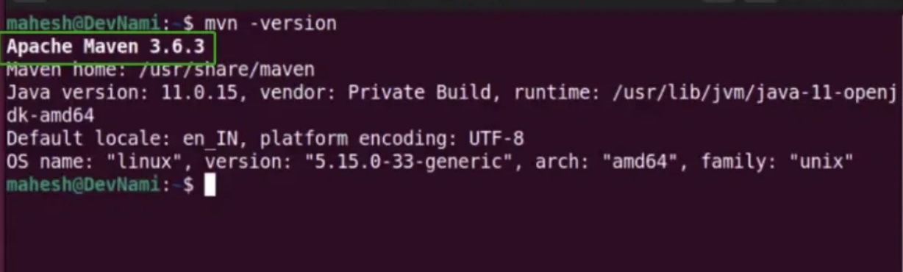

_# Spring + Maven + Spring Boot Assignment

## Question 1: Install Maven 3.6 or above and verify with `mvn -v`

To install Maven, I downloaded version 3.8.x and configured environment variables.  
After setup, I ran the following command:

```bash
mvn -v
Successfully installed Maven using IntelliJ IDEA. Below is the output of the Maven version:




## Question 2: What is the difference between Maven Central Repository and Local Repository?

Maven uses two types of repositories to manage dependencies:  
**Maven Central Repository** and **Local Repository**.

- **Maven Central Repository** is an online repository maintained by the Maven community that hosts publicly available libraries and artifacts.
- **Local Repository** is a local folder (usually located at `~/.m2/repository`) where Maven stores downloaded dependencies for offline use.
- During a build, Maven first looks for dependencies in the **local repository**; if not found, it downloads them from the **central repository**.

This mechanism helps in optimizing build time and reducing repeated downloads._


### Question 3: Common Maven Commands

Below are some essential Maven commands used to build and test Maven projects:

- **To build the Maven project**  
  This command compiles the code, runs tests, and packages the project (typically into a JAR or WAR file):

  ```bash
  mvn clean install
To run the Maven tests separately
This command runs all the test cases in the project:
mvn test'''


Please locate the maven settings.xml file and local maven repository in your machine and share the screenshot
Ans:Maven settings.xml commonly used to define the local repository.The **`settings.xml`** file is used to configure
 Maven settings like proxies, repository locations, credentials, etc. It is usually found in the following location:
~/.m2/settings.xml

The **Local Maven Repository** is the folder where Maven stores all the downloaded dependencies. By default, it is located at:

~/.m2/repository
Below is a screenshot showing the `settings.xml` file and the local Maven repository location on my machine:


